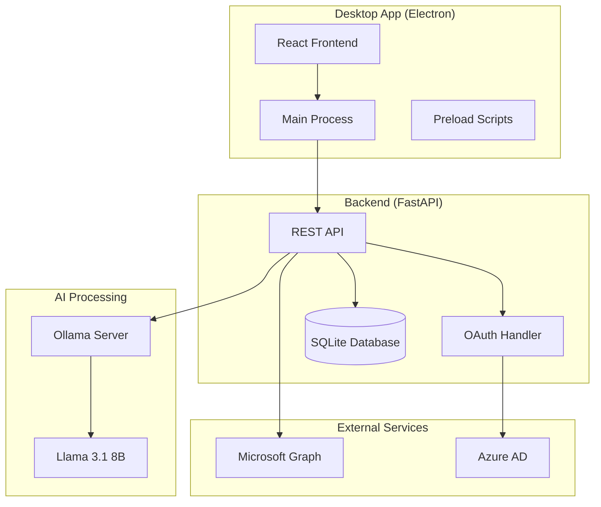

# TaskHarvester

<div align="center">


**AI-Powered Action Item Extraction from Your Communications**

[](https://github.com/jking323/TaskHarvester/actions)
[](https://sonarcloud.io/summary/new_code?id=jking323_TaskHarvester)
[](https://codecov.io/gh/jking323/TaskHarvester)
[](https://opensource.org/licenses/MIT)

[📦 Download](#download) • [🚀 Quick Start](#quick-start) • [📖 Documentation](#documentation) • [🤝 Contributing](#contributing)

</div>

## 🎯 Overview

TaskHarvester is a sophisticated desktop application that uses AI to automatically extract and organize action items from your emails, Microsoft Teams messages, and other communications. Built with a modern tech stack including Electron, React, and FastAPI, it provides a seamless and secure way to manage your tasks.

### ✨ Key Features

- **🤖 AI-Powered Extraction**: Uses Ollama with Llama 3.1 8B for local, private task extraction
- **🔐 Secure Authentication**: Microsoft OAuth integration with PKCE for enhanced security  
- **📧 Email Integration**: Automatic processing of Outlook emails and attachments
- **💬 Teams Integration**: Extract tasks from Microsoft Teams conversations
- **📊 Confidence Scoring**: AI assigns confidence levels to extracted tasks
- **🎨 Modern UI**: Professional Discord/Slack-inspired interface
- **🔒 Privacy-First**: All AI processing happens locally on your machine
- **⚡ Real-time Sync**: Live updates and notifications
- **📱 Cross-Platform**: Available for Windows, macOS, and Linux

## 📦 Download

### Latest Release (v0.1.0)

| Platform | Architecture | Download Link |
|----------|-------------|---------------|
| 🪟 **Windows** | x64 | [TaskHarvester-0.1.0-Windows-x64-Setup.exe](https://github.com/jking323/TaskHarvester/releases/latest/download/TaskHarvester-0.1.0-Windows-x64-Setup.exe) |
| 🪟 **Windows** | x86 (32-bit) | [TaskHarvester-0.1.0-Windows-ia32-Setup.exe](https://github.com/jking323/TaskHarvester/releases/latest/download/TaskHarvester-0.1.0-Windows-ia32-Setup.exe) |
| 🍎 **macOS** | Intel | [TaskHarvester-0.1.0-macOS-x64.dmg](https://github.com/jking323/TaskHarvester/releases/latest/download/TaskHarvester-0.1.0-macOS-x64.dmg) |
| 🍎 **macOS** | Apple Silicon | [TaskHarvester-0.1.0-macOS-arm64.dmg](https://github.com/jking323/TaskHarvester/releases/latest/download/TaskHarvester-0.1.0-macOS-arm64.dmg) |
| 🐧 **Linux** | x64 | [TaskHarvester-0.1.0-Linux-x64.AppImage](https://github.com/jking323/TaskHarvester/releases/latest/download/TaskHarvester-0.1.0-Linux-x64.AppImage) |

### Development Builds

For the latest features and bug fixes, check out our [development releases](https://github.com/jking323/TaskHarvester/releases?q=prerelease%3Atrue).

## 🚀 Quick Start

### System Requirements

- **Operating System**: Windows 10+, macOS 10.15+, or Ubuntu 18.04+
- **Memory**: 4GB RAM minimum, 8GB recommended
- **Storage**: 2GB free space (additional space for AI models)
- **Network**: Internet connection for initial setup and OAuth

### Installation

#### Windows
1. Download the setup file for your architecture
2. Run `TaskHarvester-x.x.x-Windows-x64-Setup.exe`
3. Follow the installation wizard
4. Launch from Start Menu or Desktop

#### macOS
1. Download the DMG file for your processor
2. Open the DMG and drag TaskHarvester to Applications
3. First launch: Right-click → Open (to bypass Gatekeeper)
4. Grant necessary permissions when prompted

#### Linux
1. Download the AppImage file
2. Make it executable: `chmod +x TaskHarvester-*.AppImage`
3. Run: `./TaskHarvester-*.AppImage`
4. Optional: Integrate with system using AppImageLauncher

### Backend Setup

TaskHarvester requires a backend server for full functionality:

1. **Install Dependencies**
   ```bash
   # Install Python 3.11+
   python --version
   
   # Install Ollama
   curl -fsSL https://ollama.ai/install.sh | sh
   
   # Install Doppler CLI
   curl -Ls https://cli.doppler.com/install.sh | sh
   ```

2. **Clone and Setup Backend**
   ```bash
   git clone https://github.com/jking323/TaskHarvester.git
   cd TaskHarvester/backend
   
   # Create virtual environment
   python -m venv venv
   source venv/bin/activate  # On Windows: venv\Scripts\activate
   
   # Install dependencies
   pip install -r requirements.txt
   ```

3. **Configure Environment**
   ```bash
   # Login to Doppler
   doppler login
   
   # Setup project
   doppler setup
   
   # Set required secrets
   doppler secrets set MICROSOFT_CLIENT_ID=your_client_id
   doppler secrets set MICROSOFT_CLIENT_SECRET=your_client_secret
   ```

4. **Download AI Model**
   ```bash
   ollama pull llama3.1:8b
   ```

5. **Start Backend**
   ```bash
   doppler run -- python -m src.main
   ```

### Microsoft Azure Setup

To enable OAuth authentication:

1. Go to [Azure Portal](https://portal.azure.com)
2. Navigate to **Azure Active Directory** → **App registrations**
3. Click **New registration**
4. Configure:
   - **Name**: TaskHarvester
   - **Redirect URI**: `http://localhost:8000/api/auth/microsoft/callback`
   - **Supported account types**: Single tenant
5. Note the **Application (client) ID**
6. Go to **Certificates & secrets** → Create new client secret
7. Configure API permissions:
   - Microsoft Graph → Delegated permissions
   - Add: `Mail.Read`, `Mail.ReadWrite`, `Calendars.Read`, `User.Read`

## 📖 Documentation

### User Guides
- [Installation Guide](docs/INSTALLATION.md)
- [User Manual](docs/USER_GUIDE.md)
- [Configuration Guide](docs/CONFIGURATION.md)
- [Troubleshooting](docs/TROUBLESHOOTING.md)

### Developer Resources
- [Development Setup](docs/DEVELOPMENT.md)
- [API Documentation](docs/API.md)
- [Architecture Overview](docs/ARCHITECTURE.md)
- [Contributing Guidelines](CONTRIBUTING.md)

### Advanced Topics
- [Security & Privacy](docs/SECURITY.md)
- [Performance Tuning](docs/PERFORMANCE.md)
- [Enterprise Deployment](docs/ENTERPRISE.md)
- [Plugin Development](docs/PLUGINS.md)

## 🏗️ Architecture



## 🔒 Security & Privacy

TaskHarvester is designed with privacy and security as core principles:

- **🏠 Local AI Processing**: All task extraction happens on your machine
- **🔐 OAuth 2.0 + PKCE**: Industry-standard authentication with enhanced security
- **🛡️ No Data Transmission**: Your emails and messages never leave your device
- **🔒 Encrypted Storage**: Local database encryption with user-controlled keys
- **🚫 Zero Telemetry**: No usage data or analytics collected
- **⚡ Minimal Permissions**: Only requests necessary Microsoft Graph permissions

## 🚀 Roadmap

### Version 0.1.0 (Current)
- [x] Core AI task extraction
- [x] Microsoft OAuth integration
- [x] Email processing
- [x] Professional UI/UX
- [x] Cross-platform builds

### Version 0.2.0 (Q1 2024)
- [ ] Teams message processing
- [ ] Calendar integration
- [ ] Task management features
- [ ] Export capabilities
- [ ] Performance optimizations

### Version 0.3.0 (Q2 2024)
- [ ] Plugin system
- [ ] Advanced AI models
- [ ] Team collaboration features
- [ ] Mobile companion app
- [ ] Enterprise features

### Future Releases
- [ ] Slack integration
- [ ] Gmail support
- [ ] Custom AI model training
- [ ] API for third-party integrations
- [ ] Advanced analytics and insights

## 🤝 Contributing

We welcome contributions from the community! Please see our [Contributing Guidelines](CONTRIBUTING.md) for details.

### Quick Contribution Steps

1. **Fork** the repository
2. **Create** a feature branch (`git checkout -b feature/amazing-feature`)
3. **Commit** your changes (`git commit -m 'Add amazing feature'`)
4. **Push** to the branch (`git push origin feature/amazing-feature`)
5. **Open** a Pull Request

### Development Environment

```bash
# Clone repository
git clone https://github.com/jking323/TaskHarvester.git
cd TaskHarvester

# Install dependencies
cd desktop && npm install
cd ../backend && pip install -r requirements.txt

# Start development servers
npm run dev  # Frontend
python -m src.main  # Backend
```

See [Development Guide](docs/DEVELOPMENT.md) for detailed setup instructions.

## 📊 Project Stats

- **Lines of Code**: ~15,000
- **Test Coverage**: 85%+
- **Supported Platforms**: 3 (Windows, macOS, Linux)
- **Supported Architectures**: 4 (x64, ia32, arm64, universal)
- **Dependencies**: Minimal and security-audited
- **Build Time**: ~5 minutes
- **Bundle Size**: ~80MB

## 🙏 Acknowledgments

- **Ollama Team** - For making local AI accessible
- **Microsoft** - For comprehensive Graph API
- **Electron Team** - For cross-platform desktop framework
- **FastAPI** - For modern Python web framework
- **React Team** - For component-based UI framework

## 📄 License

This project is licensed under the MIT License - see the [LICENSE](LICENSE) file for details.

## 📞 Support

- **🐛 Bug Reports**: [GitHub Issues](https://github.com/jking323/TaskHarvester/issues)
- **💡 Feature Requests**: [GitHub Discussions](https://github.com/jking323/TaskHarvester/discussions)
- **📖 Documentation**: [Wiki](https://github.com/jking323/TaskHarvester/wiki)
- **💬 Community**: [Discord Server](https://discord.gg/taskharvester)

---

<div align="center">

**Made with ❤️ by the TaskHarvester Team**

[⭐ Star us on GitHub](https://github.com/jking323/TaskHarvester) • [🐦 Follow on Twitter](https://twitter.com/taskharvester) • [📧 Email Us](mailto:hello@taskharvester.com)

</div>